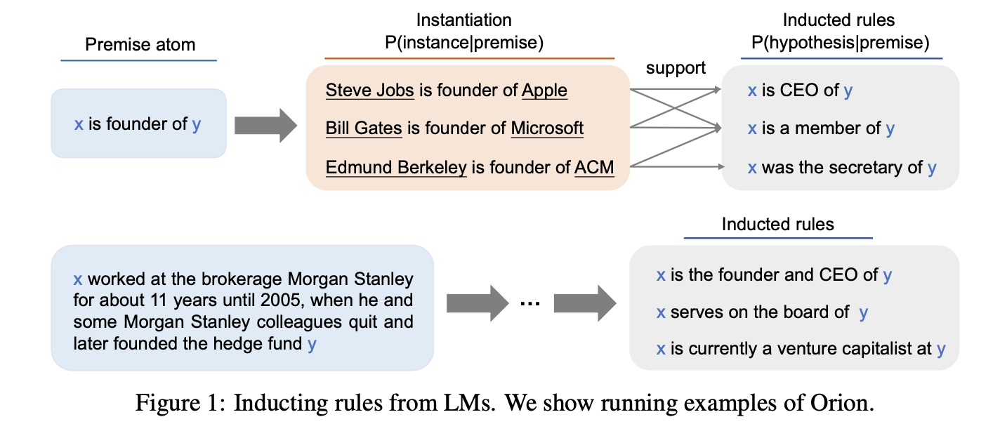

# Open Rule Induction



This repository is the official implementation of [Open Rule Induction](https://arxiv.org/abs/2110.13577). This paper has been accepted to NeurIPS 2021.


## Abstract
Rules have a number of desirable properties. It is easy to understand, infer new knowledge, and communicate with other inference systems. One weakness of the previous rule induction systems is that they only find rules within a knowledge base (KB) and therefore cannot generalize to more open and complex real-world rules. Recently, the language model (LM)-based rule generation are proposed to enhance the expressive power of the rules. In this paper, we revisit the differences between KB-based rule induction and LM-based rule generation. We argue that, while KB-based methods inducted rules by discovering data commonalitiess, the current LM-based methods are “learning rules from rules”. This limits these methods to only produce “canned” rules whose patterns are constrained by the annotated rules, while discarding the rich expressive power of LMs for free text.

Therefore, in this paper, we propose the open rule induction problem, which aims to induce open rules utilizing the knowledge in LMs. Besides, we propose the Orion (open rule induction) system to automatically mine open rules from LMs without supervision of annotated rules. We conducted extensive experiments to verify the quality and quantity of the inducted open rules. Surprisingly, when applying the open rules in downstream tasks (i.e. relation extraction), these automatically inducted rules even outperformed the manually annotated rules.

## Dependencies

To install requirements:

```
conda env create -f environment.yml
conda activate orion
```

## Download the Orion

We have released the continue trained models for $P(ins|r_p)$ and $P(r_h|ins)$, you could just download them following the steps:

```
mkdir models
cd models
```
Then you should download two parts of Orion to here.

1. Download model for $P(ins|r_p)$ from [here](https://drive.google.com/drive/folders/1dgWZS4Cr_QHpGPJ8Rju4Gd_93s340K-v?usp=sharing)

2. Download model for $P(r_h|ins)$ from [here](https://drive.google.com/drive/folders/1syg5b6AmlAT7k2Sx1JpLFXKNX6fOeNoC?usp=sharing)


## Evaluate for OpenRule155

To evaluate Orion's performance on OpenRule155 or other relation extraction datasets, run this command:

```
python evaluation.py --task openrule155 --inductor rule --mlm_training True --bart_training True --group_beam True
```

## Evaluate for Relation Extraction

To evaluate Orion's performance on other relation extraction datasets, run this command:

```
python evaluation.py --task <task> --inductor rule --mlm_training True --bart_training True --group_beam True
```

## Evaluate for costomize rule

If you want to experience it with your costomize rules, follow this:

```
from inductor import BartInductor

inductor = BartInductor()

rule = '<mask> is the capital of <mask>.'
generated_texts = inductor.generate(rule)

print('output generated rules:')
for text in generated_texts:
    print(text)

# output generated rules:
# <mask> is the capital and largest city of <mask>.
# <mask> is the largest city in <mask>.
# <mask> is the most populous state in <mask>.
# <mask> is the capital of <mask>.
# <mask> is a state in <mask>.
# <mask> is a capital of <mask>.
# <mask> has one of the highest rates of poverty in <mask>.
# <mask> is a major commercial and financial centre of <mask>.
# <mask> was then a part of <mask>.
# <mask>, the capital of the country, is the largest city in <mask>.
```
